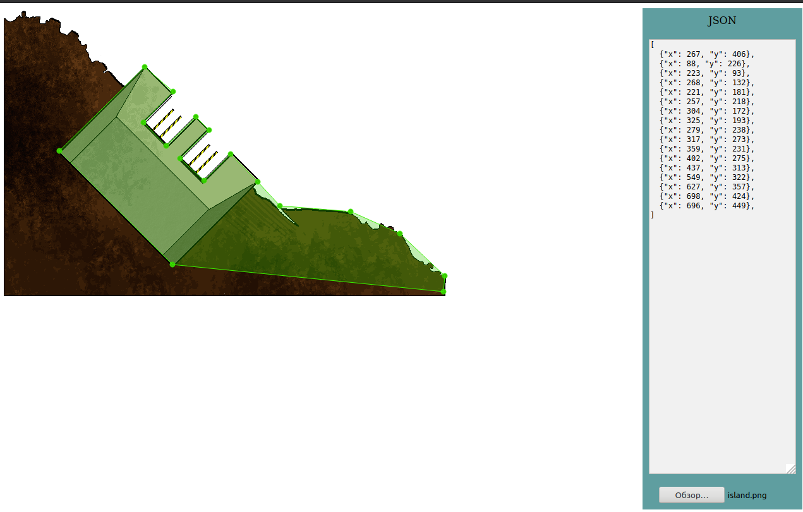

# Обводильщик

Для игры требуется сохранять физические координаты объектов.

Утилита позволяет загрузить спрайт, мышкой выбрать узловые точки на спрайте и на выходе получить json объект. 
Позволет, перетаскивать точки, а так же удалять (при перетаскивании нажать [delete])



Запуск:
```
python main.py
```
или через докер:
```
docker-compose up --build
```